## סיכום ההרצאה: עריכה גנטית וההיסטוריה של החיים על פני כדור הארץ

### עריכה גנטית: חידושים ואתגרים

בשנים האחרונות חלה התקדמות מרשימה בתחום העריכה הגנטית, במיוחד עם אישור ה-FDA לטיפול שמרפא מוטציות גנטיות. טיפול זה, המיועד למחלות גנטיות קשות, מתבצע באמצעות שינוי רצף ה-DNA של התאים, בין אם בתוך הגוף ובין אם מחוצה לו, ואז החזרתם לחולים. מדובר בטכנולוגיה שזמינה כבר היום ולא בעתיד הרחוק, אך היא מעלה שאלות אתיות רבות, כולל העלות הגבוהה של הטיפולים והזמינות שלהם לכלל האוכלוסייה בעולם.

הדיאגרמה הבאה מציגה את הגדרת החיים באמצעות מספר מאפיינים מרכזיים:

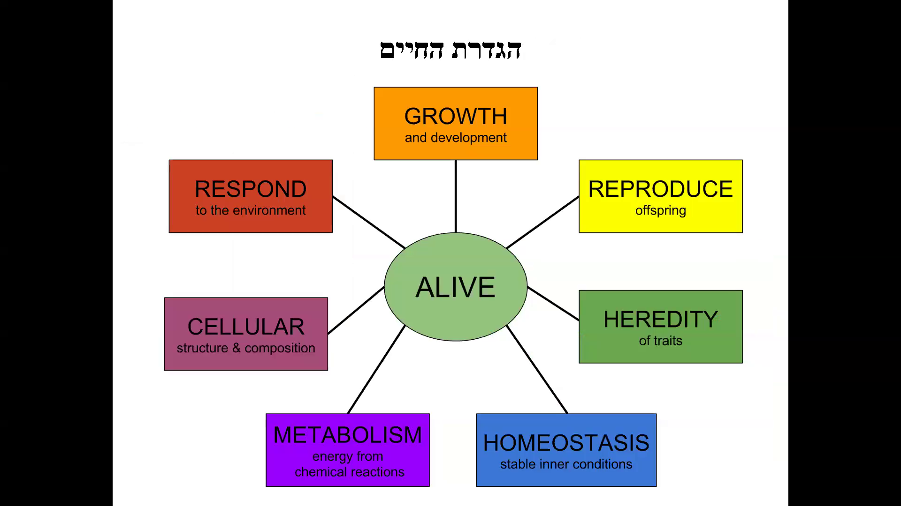

### הגדרת החיים

הגדרת החיים היא נושא מורכב הכולל מספר מאפיינים:
1. **גדילה והתפתחות** (Growth and development)
2. **רבייה** (Reproduce offspring)
3. **תורשה** (Heredity of traits)
4. **הומיאוסטזיס** (Homeostasis)
5. **מטבוליזם** (Metabolism)
6. **תגובה לסביבה** (Respond to the environment)
7. **מבנה ותכולה תאית** (Cellular structure & composition)

### התפתחות החיים על פני כדור הארץ

החיים על פני כדור הארץ החלו לפני כ-3.5 מיליארד שנים עם הופעת תאים חד-תאיים פרוקריוטיים. תאים אלו התפתחו בהמשך לתאים אאוקריוטיים, אשר כוללים גרעין ואברונים. אורגניזמים רב-תאיים הופיעו רק במיליארד השנים האחרונות.

הדיאגרמה הבאה מציגה את ההתפתחות ההיסטורית של החיים על פני כדור הארץ:

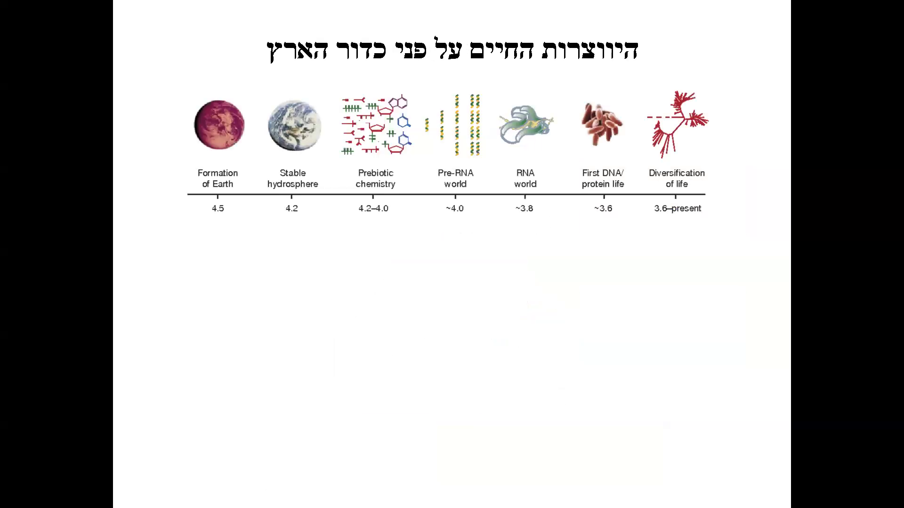

### חשיבות הבנת ההיסטוריה של החיים

הבנת ההיסטוריה של החיים על פני כדור הארץ חשובה מכיוון שהיא מאפשרת לנו ללמוד על המנגנונים הביולוגיים הבסיסיים ועל התפתחות החיים. רוב המנגנונים הקיימים באורגניזמים פשוטים קיימים גם באורגניזמים מורכבים כמו בני אדם. לכן, חקר האורגניזמים הפרוקריוטיים חשוב במיוחד להבנת מחלות זיהומיות.

הדיאגרמה הבאה מציגה את היסטוריית כדור הארץ ב-12 שעות:

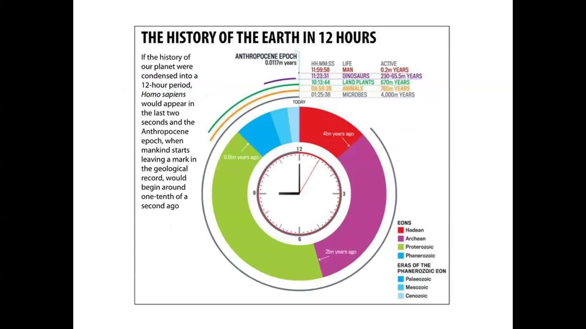

### פרוקריוטים ואאוקריוטים

פרוקריוטים הם התאים העתיקים ביותר, קטנים ופשוטים, חסרי גרעין ועברונים, והם בהכרח חד-תאיים. אאוקריוטים התפתחו מהפרוקריוטים, הם גדולים ומורכבים יותר, כוללים גרעין ועברונים, ויכולים להיות חד-תאיים או רב-תאיים.

הדיאגרמה הבאה משווה בין פרוקריוטים ואאוקריוטים:

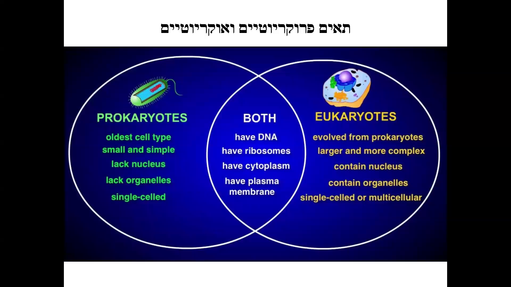

### אורגניזמים חד-תאיים ורב-תאיים

אורגניזמים חד-תאיים כוללים אמבה, חיידקים ופרמיציום, בעוד שאורגניזמים רב-תאיים כוללים צמחים ובעלי חיים.

הדיאגרמה הבאה מדגימה את ההבדלים בין אורגניזמים חד-תאיים ורב-תאיים:

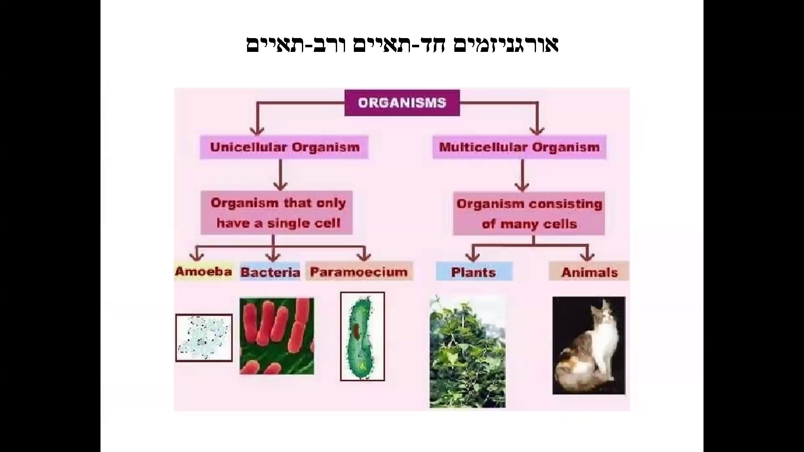

### הגדלים היחסיים של תאים ורכיביהם

הגרף הבא מציג את הגדלים היחסיים של תאים ורכיביהם, כולל מולקולות קטנות, וירוסים, חיידקים ותאים חיים.

הגרף הבא ממחיש את הגדלים היחסיים של תאים ורכיביהם:

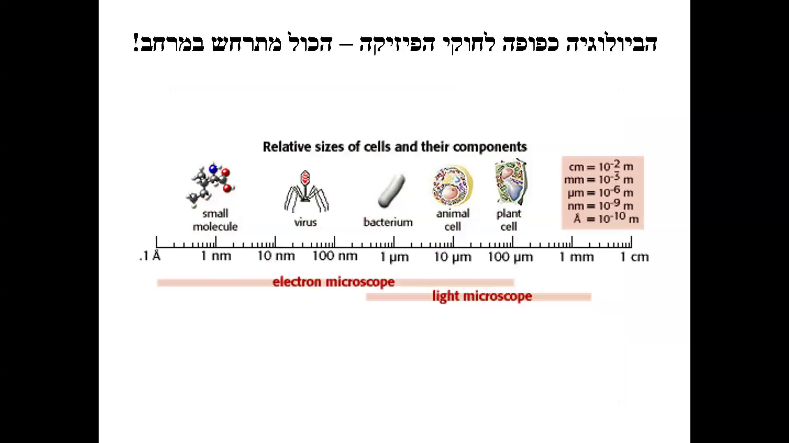

### התפתחות עוברית

התרשים הבא מציג את שלבי ההתפתחות העוברית על פני 14 ימים, החל מביצית מופרית ועד להתפתחות שכבות נבט והתחלת היווצרות איברים.

התרשים הבא מציג את שלבי ההתפתחות העוברית:

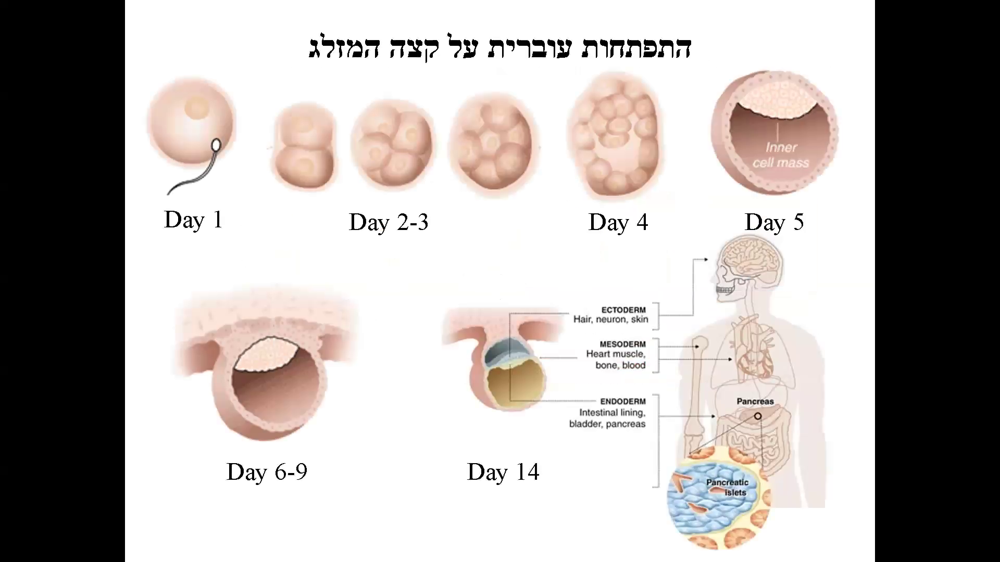

### סיכום

ההרצאה עסקה במגוון נושאים חשובים בתחום הביולוגיה, כולל חידושים בעריכה גנטית, הגדרת החיים, התפתחות החיים על פני כדור הארץ, וההבדלים בין פרוקריוטים ואאוקריוטים. הבנת הנושאים הללו חשובה לא רק למחקר המדעי אלא גם לטיפול במחלות ולפיתוח טכנולוגיות רפואיות חדשות.# התפתחות עוברית וביולוגיה מולקולרית

## סיכום ההרצאה: התפתחות עוברית והביטוי הגנטי

### שלבי ההתפתחות העוברית

בהרצאה זו נעסוק בתהליך ההתפתחות העוברית, החל מהביצית המופרית ועד לעובר השלם. נתחיל בהבנה של השלבים הראשונים של ההתפתחות:

בתהליך ההתפתחות העוברית, הביצית המופרית מתחלקת לתאים רבים ומתחילה ליצור מבנים מורכבים יותר. ביום החמישי לאחר ההפריה, נוצרת הבלסטוסיסט, שבה יש את ה-inner cell mass (ICM) שממנו יתפתח העובר כולו, וכן מעטפת שתהפוך לשליה.

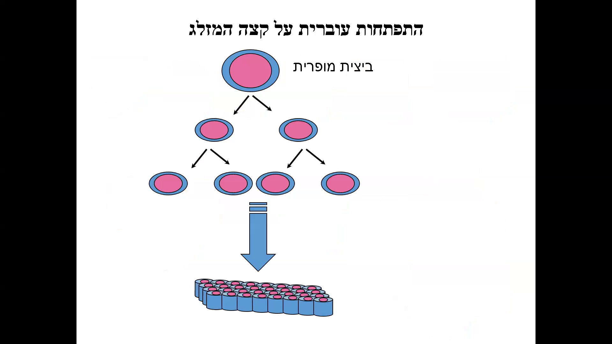

לאחר מכן מתחילה גסטרולציה, שבה נוצרים שלוש שכבות הנבט: האקטודרם, המזודרם והאנדודרם. תאים אלו ממשיכים לעבור התמחות ולהיות ספציפיים יותר ויותר עד לקבלת העובר השלם.

### התמחות תאים ושינוי בביטוי הגנים

התהליך של התמחות התאים כולל שינוי בביטוי הגנים. זהו תהליך מורכב של ביטוי והשתקה של גנים שונים, המוביל להתפתחות העוברית. התאים שלנו שונים זה מזה כי הם מבטאים ברמות שונות סטים אחרים של גנים.

### מבנה ה-DNA והתאים בגוף האדם

בגופנו ישנם טריליוני תאים, וכל תא מכיל את אותו מטען גנטי. בכל תא יש לנו 46 כרומוזומים, המורכבים משני מטר של DNA. ה-DNA מכיל 3.3 מיליארד זוגות בסיסים המקודדים בין 20 ל-30 אלף גנים.

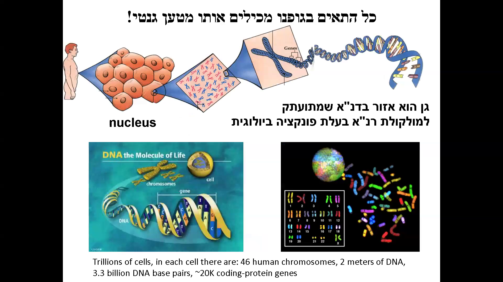

### חשיבות הדחיסה של ה-DNA

ה-DNA בגופנו נאגז בצורה מאוד דחוסה כדי להיכנס לגרעין התא. תהליך זה מאפשר ל-DNA להשתחרר ולהיות משועתק לפעילותו.

הדיאגרמה שלפנינו מציגה את תהליך הדחיסה והאריזה של ה-DNA בתא. חשוב להבין את התהליכים המאפשרים ל-DNA להיערז ולהידחס, וכן להשתחרר כדי להיות משועתק.

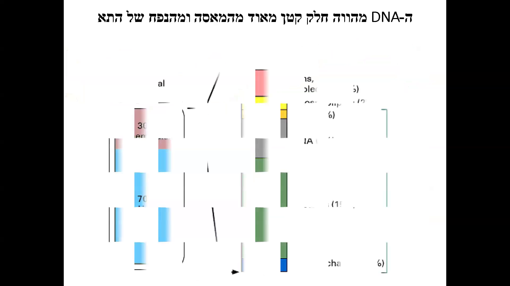

### השפעת הסביבה על הפעלה והשתקה של גנים

הפעלה והשתקה של גנים מושפעת מהסביבה. זהו נושא שנדון בו בהמשך הקורס.

### עץ אבולוציוני והקשרים הגנטיים בין מינים

הריצוף הגנטי שינה את האופן שבו אנו מבינים את האבולוציה. כיום אנו יודעים שיש לנו זהות של 98% ברצף הגנטי עם שמפנזים ו-80% עם עכברים. היכולת להסתכל על דברים דרך ה-DNA שינתה את המחקר הגנטי והבנת האבולוציה.

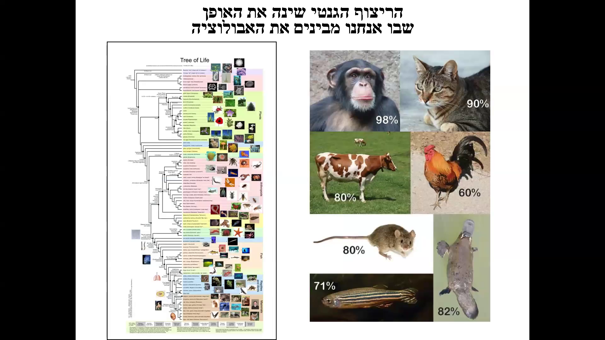

### הזהות הגנטית בין בני אדם

בני אדם חולקים 99.9% מרצף ה-DNA זה עם זה. הבדלים קטנים אלו יכולים להשפיע על תכונות ומחלות. 

המפה שלפנינו מציגה את התפשטות בני האדם מהיבשת אפריקה לשאר העולם. למרות השונות הגנטית הקטנה, כולנו חולקים את אותו רצף DNA ב-99.9%.

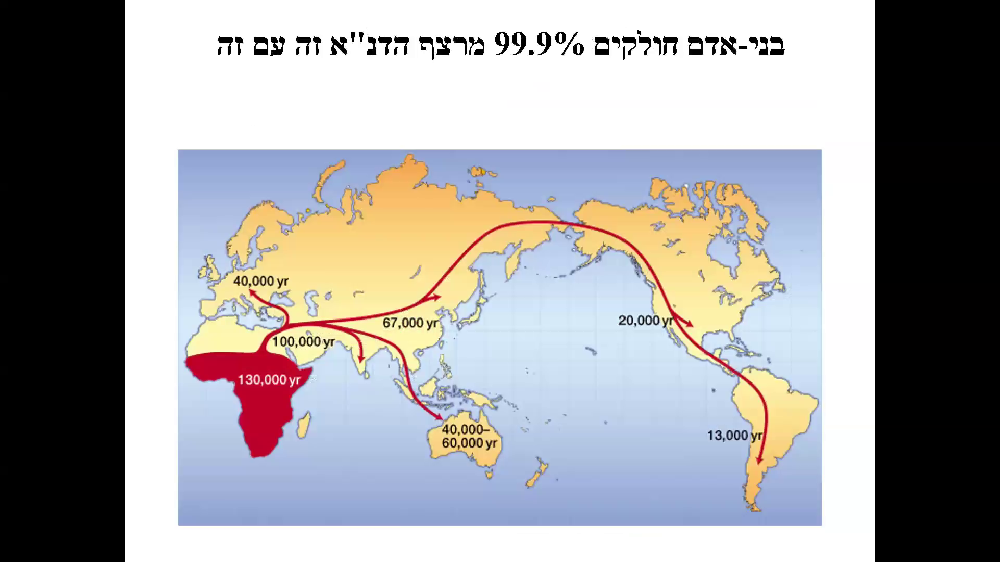

### סיכום

ההרצאה עסקה בתהליך ההתפתחות העוברית, התמחות התאים ושינוי בביטוי הגנים, מבנה ה-DNA והתאים בגוף האדם, השפעת הסביבה על הפעלה והשתקה של גנים, והקשרים הגנטיים בין מינים שונים ובין בני אדם. נושא זה הוא מורכב ומרתק, וימשיך להיות נידון בהרחבה במהלך הקורס.## סיכום הקורס: ביולוגיה מולקולרית

### הקדמה: שונות גנטית והשפעותיה

המרצה מתחיל בהסבר על השונות הגנטית בין בני אדם. הוא מציין כי בעמדה מסוימת בדנ"א יכול להיות בסיס אחד, ובעמדה אחרת בסיס שונה. השונות הזו היא שמביאה להבדלים בינינו, הן חיצוניים והן פנימיים. לדוגמה, שני בני אדם יכולים להיות שונים באלפי נוקלאוטידים, וזהו הבדל משמעותי המשפיע על האוכלוסייה.

### השפעות השונות הגנטית על הרפואה

השונות באוכלוסייה יש לה השלכות משמעותיות, במיוחד בתחום הרפואה. באופן מסורתי, רוב המחקר הרפואי נעשה על אנשים לבנים (קוקזיונס), אך היום מבינים יותר ויותר את החשיבות של הרקע הגנטי והשפעתו על הפוטנציאל של טיפול במחלות שונות ותגובה לתרופות. לכן, חשוב לחקור את כל האוכלוסיות כדי להבין את ההבדלים ביניהן ולספק את הטיפול הרפואי הטוב ביותר.

### המשך המחקר על הגנום האנושי

המרצה מדגיש את החשיבות של המשך המחקר על הגנום האנושי. למרות שהוכרז ב-2003 כי סיימו למפות את הגנום האנושי, עדיין ישנם אזורים שלא נבחנו במלואם. התמונה המצורפת מציגה שער של מגזין "Science" עם הכותרת "Filling the Gaps" (מילוי הפערים), המדגישה את הצורך במחקר נוסף.

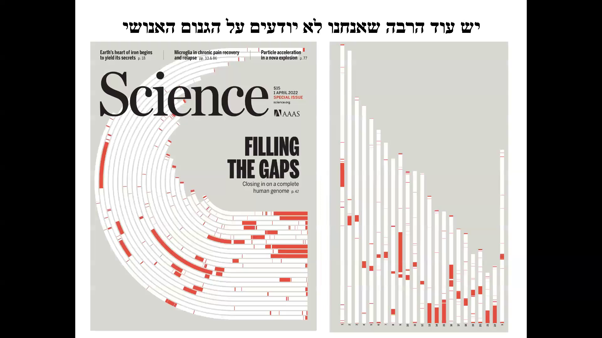

### תוכנית הקורס

הקורס יכסה מגוון רחב של נושאים בביולוגיה מולקולרית:

1. מבנה וכימיה של DNA
2. DNA גנומי, גנים וכרומטין
3. שכפול, מוטציה ותיקון DNA
4. מבנה RNA ושעתוק
5. רגולציה טרנסקריפציונית באאוקריוטים
6. עיבוד RNA
7. סינתזת חלבונים והקוד הגנטי
8. קיפול חלבונים, עיבוד ופירוק
9. שיטות נפוצות בבביולוגיה מולקולרית
10. הבסיס המולקולרי של הסרטן
11. טרנספוזונים והתפתחות הגנום האנושי
12. עריכת גנום לרפואה מותאמת אישית

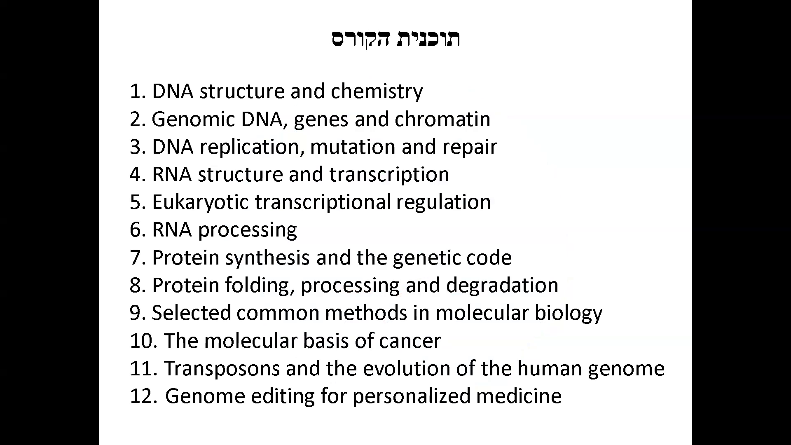

### סיכום הקורס

הקורס יספק הבנה בסיסית של תהליכים מולקולריים, אך יש לזכור שכל נושא שנלמד מבוסס על עשרות שנים של מחקר ומספר לא מבוטל של פרסי נובל. במהלך הקורס, הסטודנטים ילמדו על מבנה ה-DNA, תהליכי השכפול, מוטציות ותיקון DNA, מבנה ה-RNA ותהליך הטרנסקריפציה, סינתזת חלבונים והקוד הגנטי, וכמובן שיטות מחקר בביולוגיה מולקולרית.

בסוף הקורס, הסטודנטים יתמקדו בשלוש יחידות לימוד המסכמות את התכנים שנלמדו, תוך דגש על הביג פיקצ'ר:
1. הבסיס המולקולרי של הסרטן
2. טרנספוזונים והתפתחות הגנום האנושי
3. עריכת גנים ויישומיה ברפואה

### סיום הקורס

המרצה מסיים באיחולי הצלחה לסטודנטים ומדגיש את החשיבות של הבנת התהליכים המולקולריים להמשך המחקר והפיתוח בתחום.

---

שאלות נוספות? תודה רבה, מאחל לכם סימסטר מוצלח!
