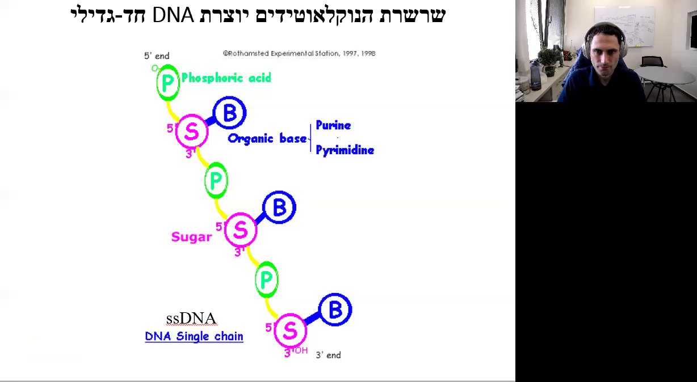
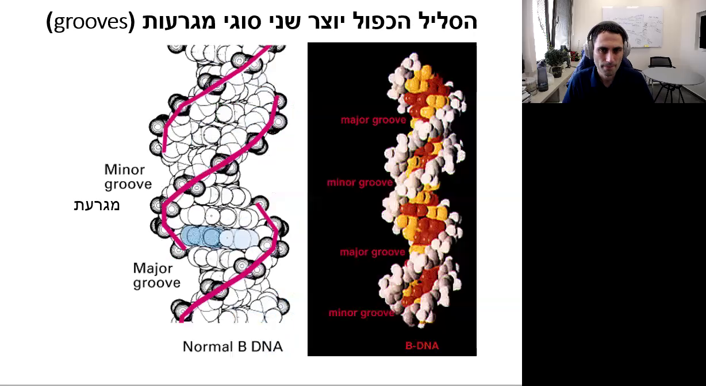
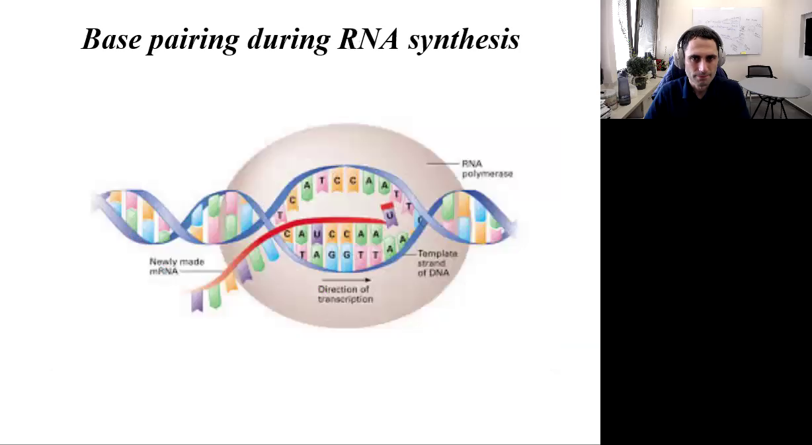

# מבנה ה-DNA ותהליך העברת האינפורמציה הגנטית

## מבוא
במהלך ההרצאה נדבר על מבנה ה-DNA ועל תהליך העברת האינפורמציה הגנטית. תהליך זה מחולק לשלושה חלקים עיקריים: רפליקציה, טרנסקריפציה ותרגום. נתחיל בהבנת המבנה הכימי של ה-DNA והנוקלאוטידים המרכיבים אותו.

## תהליך העברת האינפורמציה הגנטית

התרשים הבא מציג את תהליך העברת האינפורמציה בגנטיקה. המעבר מ-DNA ל-RNA מתבצע באמצעות תהליך השעתוק (Transcription), ומ-RNA לחלבון באמצעות תהליך התרגום (Translation). כמו כן, מופיע חץ כחול שמתאר שעתוק הפוך (Reverse Transcription), שבו RNA משועתק חזרה ל-DNA.

### שלושת החלקים של תהליך העברת האינפורמציה הגנטית
1. **רפליקציה**: הכפלת ה-DNA ליצירת DNA חדש על בסיס האינפורמציה של ה-DNA הקיים.
2. **טרנסקריפציה (שעתוק)**: יצירת RNA על בסיס האינפורמציה של ה-DNA.
3. **תרגום (טרנסלציה)**: יצירת חלבון על בסיס האינפורמציה המקודדת ב-RNA.

## מבנה ה-DNA
### נוקלאוטידים

נוקלאוטידים הם אבני הבניין של ה-DNA בכל היצורים החיים. הם מורכבים משלושה חלקים עיקריים: פוספט, בסיס אורגני וסוכר.

### מבנה כימי של נוקלאוטיד
- **סוכר**: מבנה של חמישה פחמנים (עמדות 1, 2, 3, 4 ו-5).
- **פוספט**: מחובר בקשר קובלנטי לסוכר.
- **בסיס אורגני**: מחובר בקשר קובלנטי לסוכר.

התרשים הבא מציג את המבנה הכימי של נוקלאוטיד, הכולל את הפוספט, הבסיס האורגני והסוכר.

### סוגי סוכרים
ישנם שני סוגים של סוכרים בטבע:
1. **דאוקסי ריבוז**: סוכר עם שני מימנים בעמדה מספר שתיים, נמצא במולקולות של DNA.
2. **ריבוז**: סוכר עם קבוצת הידרוקסיל בעמדה מספר שתיים, נמצא במולקולות של RNA.

התרשים הבא מציג את ההבדלים בין ריבוז (RNA) לדאוקסי ריבוז (DNA). ריבוז מסומן עם קבוצת OH בעמדה 2', בעוד דאוקסי ריבוז מסומן עם קבוצת H בעמדה 2'.

### בסיסים אורגניים
ישנם ארבעה סוגי בסיסים אורגניים שקשורים לעמדה מספר אחת של הדאוקסי ריבוז:
1. **A** (אדנין)
2. **G** (גואנין)
3. **T** (טימין)
4. **C** (ציטוזין)

במולקולות של RNA, במקום טימין (T) ישנו הבסיס **U** (אורציל).

התרשים הבא מציג את המבנה הכימי של הבסיסים של ה-DNA וה-RNA. בסיסים אלו מחולקים לשתי קבוצות עיקריות: פורינים ופרימידינים.

### קבוצות בסיסים
- **פורינים**: בעלי שתי טבעות (A ו-G).
- **פרימידינים**: בעלי טבעת אחת (C, T ו-U).

## סיכום
בהרצאה זו סקרנו את מבנה ה-DNA, הנוקלאוטידים המרכיבים אותו ואת תהליך העברת האינפורמציה הגנטית. בנינו בסיס להבנה מעמיקה של התהליכים המולקולריים הקשורים ל-DNA ו-RNA, אשר מהווים את היסוד לכל החיים על פני כדור הארץ.### מבנה הנוקלאוטידים והרכב ה-DNA

**00:05:02 - 00:05:06**  
האטומים שקשורים לעמדה מספר 6 הם חלק מהמבנה הכימי של הבסיסים החנקניים המרכיבים את ה-DNA.

**00:05:06 - 00:05:08**  
עמדה מספר 6 היא חלק חשוב במבנה זה.

**00:05:08 - 00:05:11**  
באדנין (Adenine) יש קבוצה אמינית בעמדה מספר 6.

**00:05:11 - 00:05:13**  
בגואנין (Guanine) יש חמצן בעמדה זו.

**00:05:14 - 00:05:19**  
בעמדה מספר 2 של הגואנין יש קבוצה אמינית, בעוד שבעמדה מספר 2 של האדנין יש רק קבוצת מימן.

**00:05:19 - 00:05:24**  
באופן דומה, בציטוזין (Cytosine) יש קבוצה אמינית בעמדה מספר 4, בעוד שבתימין (Thymine) יש חמצן.

**00:05:24 - 00:05:28**  
ההבדלים בין הבסיסים אינם באטומים שבתוך הטבעת, אלא בקבוצות הצד שקשורות לטבעות.

**00:05:28 - 00:05:33**  
הסוכר והפוספט זהים לחלוטין בין הבסיסים.

התרשים הבא מתאר את המבנה של נוקלאוטידים, המחולקים לבסיסים ונוקלאוטידים. הבסיסים מחולקים לפורינים (Adenine, Guanine) ולפירימידינים (Thymine, Cytidine, Uracil). נוקלאוזידים מורכבים מבסיס ודאוקסיריבוז (Deoxyribose) או ריבוז (Ribose). נוקלאוטידים מורכבים מנוקלאוזיד ופוספט (Phosphate).

**00:05:48 - 00:05:53**  
השוני בין הנוקלאוטידים הוא הבסיס שמצומד לסוכר. לכן, הנוקלאוטיד נקרא על שם הבסיס.

**00:05:53 - 00:05:57**  
אם הבסיס הוא אדנין, הנוקלאוטיד כולו יקרא אדנוזין, וכן הלאה: גואנין - גואנוזין, תימין - תימידין, ציטוזין - ציטידין, ואורציל - אורידין.

**00:05:57 - 00:06:08**  
יש לשנן ולהכיר בעל פה את שמות הנוקלאוטידים. ישנן ארבע אותיות בספר החיים: A, T, C, G (אדנין, תימין, ציטוזין, גואנין), המהוות את הבסיס לכל ה-DNA של כל היצורים החיים.

התרשים הבא מציג את המבנים הכימיים של מולקולות DNA או RNA עם ארבעת הבסיסים החנקניים: אדנין (A), תימין (T), ציטוזין (C), גואנין (G) ואורציל (U). כל אחד מהבסיסים מסומן בצבעים שונים המייצגים את האטומים השונים.

**00:06:30 - 00:06:32**  
בטבעות הסוכר, עמדות 1 ו-4 מחוברות בקשר קובלנטי לחמצן.

**00:06:32 - 00:06:38**  
עמדה מספר 5 נמצאת מחוץ לטבעת וקשורה בקשר קובלנטי לחמצן, שמחובר לפוספט.

**00:06:38 - 00:06:41**  
עמדה מספר 1 קשורה בקשר קובלנטי לקבוצה שמכילה שתי טבעות (פורינים).

**00:06:41 - 00:06:45**  
בפורינים יש טבעת נוספת (פירימידינים).

התרשים הבא מסביר את מבנה ה-DNA. הוא מציג את הרכיבים הבאים: חומצה זרחתית (Phosphoric acid) בצבע ירוק, בסיס אורגני (Organic base) בצבע כחול, וסוכר (Sugar) בצבע ורוד. התרשים מראה את הקשרים בין הרכיבים השונים.

**00:07:05 - 00:07:07**  
ליצירת DNA חד-גדילי (Single Strand DNA), נוקלאוטיד אחד מחובר לנוקלאוטיד אחר בקשר פוספו-די-אסטרי.

**00:07:07 - 00:07:09**  
כך נראה DNA חד-גדילי: נוקלאוטיד 1, נוקלאוטיד 2, נוקלאוטיד 3.

**00:07:09 - 00:07:14**  
מבנה זה נקרא DNA חד-גדילי (Single Strand DNA).

**00:07:14 - 00:07:19**  
בשרשרת ה-DNA, הנוקלאוטידים מחוברים בקשר פוספו-די-אסטרי בין פוספט של נוקלאוטיד אחד לסוכר של נוקלאוטיד אחר.

התרשים הבא מציג את מבנה הקשר הפוספודיאסטרי ב-DNA, כולל התוויות הבאות: קשר 5' - 3' פוספו-די-אסטרי, כיווניות, צד 5' וצד 3', במעלה הזרם (upstream) ובמורד הזרם (downstream).

**00:07:43 - 00:07:47**  
נבחן את המבנה הכימי של ה-DNA: ישנם שלושה נוקלאוטידים המחוברים בקשר פוספו-די-אסטרי.

**00:07:47 - 00:07:50**  
הקשר שמחבר בין נוקלאוטיד אחד לשני הוא קשר 3-5 פוספו-DNA.

**00:07:50 - 00:07:53**  
עמדה מספר 3 של סוכר אחד מחוברת לעמדה מספר 5 של סוכר שני באמצעות פוספט עם שני קשרים אסתרים.

**00:07:53 - 00:07:56**  
לכן, ל-DNA יש כיווניות.

**00:07:56 - 00:08:02**  
ב-DNA של יצורים אאוקריוטים יש שני קצוות: קצה 5 וקצה 3. הנוקלאוטיד הראשון בשרשרת מחובר לפוספט שלא מחובר לסוכר אחר, ולכן הקצה הזה נקרא קצה 5 (Five prime end). הנוקלאוטיד בקצה השני מחובר לפוספט, ולכן הקצה הזה נקרא קצה 3 (Three prime end).

**00:08:02 - 00:08:05**  
לכן, ל-DNA לינארי יש שני קצוות: קצה 5 וקצה 3.

**00:08:05 - 00:08:08**  
אם מסתכלים לכיוון 5, אומרים שאנחנו מסתכלים אאוקריוטים.

**00:08:08 - 00:08:10**  
אם מסתכלים לכיוון 3, אז אנחנו מסתכלים תאורי בל (Boiler).

**00:08:10 - 00:08:12**  
אפשר לחשוב על זה כמו על צינור שמחובר לברז, שהוא נקודת ההתחלה, ומגיע לבריכה, נקודת הסיום.

**00:08:12 - 00:08:16**  
אם אנחנו נמצאים באמצע הצינור, כל מה שנמצא בינינו לבין הברז נמצא אפסטרים אלינו, וכל מה שנמצא בינינו לבין הבריכה נמצא דאונסטרים איתנו.

**00:08:16 - 00:08:20**  
אם נעמוד על האדנוזין, הנוקלאוטיד שנמצא אפסטרים אליו הוא הציטוזין, וזה שנמצא דאונסטרים זה הגואנין.

**00:08:20 - 00:08:24**  
בחיידקים יש DNA מעגלי. אין לו קצוות, אבל עדיין לכל נוקלאוטיד יש כיוון 5 פריים ו-3 פריים, לפי עמדות 5 ו-3 של הסוכר.

התרשים הבא מציג דרך גרפית לתיאור רצף ה-DNA. הוא מציג מבנה כימי של שלושת הנוקלאוטידים C, A, ו-G, כולל קבוצות הפוספט (P) וקבוצת ה-OH. מתחת למבנה הכימי מופיע הרצף 5' C-A-G 3'. בנוסף, מופיע רצף DNA מלא: 5'GAACCTGAGACCTACTGTGCCG3'.

**00:09:33 - 00:09:36**  
יש הרבה דרכים לתיאור רצף ה-DNA. הדרך הבסיסית היא לרשום את הבסיסים לפי האותיות.

**00:09:36 - 00:09:38**  
הכיוון הוא תמיד משמאל לימין.

**00:09:39 - 00:09:41**  
בדרך כלל יהיה כתוב 5 פריים בהתחלה ו-3 פריים בסיום, אבל גם אם לא כתוב לנו שום דבר, זו היא תמיד הכיווניות.

**00:09:42 - 00:09:48**  
תזכרו שכותבים את זה באנגלית והכיווניות היא כמו באנגלית, משמאל לימין.

**00:09:48 - 00:10:00**  
איך אנחנו יודעים שהרצף הזה מייצג רצף של DNA ולא של RNA?### מבנה ה-DNA הדו-גדילי והליפוף שלו

#### זיווג בסיסים ווטסון-קריק (00:10:01 - 00:11:07)

ה-DNA מורכב מגדילים של נוקלאוטידים, כאשר כל נוקלאוטיד מכיל בסיס חנקני. הבסיסים מתחברים ביניהם בזיווגים ספציפיים: A (אדנין) מתחבר ל-T (תימין) עם שני קשרי מימן, ו-G (גואנין) מתחבר ל-C (ציטוזין) עם שלושה קשרי מימן. זיווגים אלו נקראים זיווגי בסיסים ווטסון-קריק. קשרי המימן חלשים יותר מקשרים קובלנטיים ולכן ניתן לנתקם בטמפרטורה גבוהה.

התמונה הבאה מציגה תרשים של מבנה DNA-דו-גדילי (dsDNA) עם כיתוב בעברית. התרשים מראה את זוגות הבסיסים (bp) ואת המבנה הכימי של ה-DNA. בצד ימין של התמונה יש טקסטים בעברית המסבירים את המונחים "זוג בסיסים" ו-"DNA-דו-גדילי".

#### גדילים משלימים וכיווניות (00:11:08 - 00:12:11)

זיווג הבסיסים מאפשר יצירת DNA דו-גדילי. כל גדיל של DNA הוא אנטי-פרללי, כלומר הכיווניות של הגדילים היא הפוכה. הכיווניות מוגדרת על ידי הקצוות 5' ו-3'. הפוספטים והסוכרים של הגדילים פונים החוצה, בעוד שהבסיסים פונים פנימה ויוצרים קשרי מימן ביניהם. כל זיווג בסיסים הוא כמו שלב בסולם.

התמונה הבאה מציגה שקופית של מצגת עם הכותרת "כיווניות הליפוף של הסליל הכפול". בשקופית מוצגים שני דגמים של סליל כפול של DNA: הימני מסומן כ"נכון" והמשמאלי כ"לא נכון". ליד כל דגם יש הסבר על כיווניות הליפוף.

#### דחיסת ה-DNA (00:12:28 - 00:13:07)

ה-DNA בכל תא הוא באורך של כ-2 מטרים, אך הוא צריך להידחס לתוך גרעין תא שהכותר שלו הוא כ-10 מיקרומטר. לשם כך, ה-DNA מלופף בצורה ספציפית. הליפוף הוא תמיד לימין, ואם הוא לשמאל זה לא תקין. הבסיסים פונים למרכז הציר של הליפוף בזווית של 90 מעלות לציר הפיתול.

תמונה זו מציגה תרשים של מולקולת DNA. ניתן לראות את עמוד השדרה הפוספטי-סוכרי (Sugar-phosphate backbone) ואת הבסיסים המחוברים ביניהם בקשרי מימן. בצד ימין של התרשים מופיעים הסברים בעברית: "הסליל הכפול סובב ציר מרכזי" ו-"הבסיסים פונים למרכז הציר".

#### קשרי סטקינג ומבנה הסליל הכפול (00:13:44 - 00:14:06)

במבנה הסליל הכפול של ה-DNA, ישנם קשרים תוך מולקולריים הנקראים קשרי סטקינג (stacking) שהם קשרי וונדר ולס. קשרים אלו מחזקים את המבנה הסלילי. הליפוף הימני של ה-DNA יוצר שני סוגי מגרעות: מגרעת רחבה (Major groove) ומגרעת צרה (Minor groove). חלבונים מזהים ונקשרים ל-DNA במגרעות אלו, מה שמוביל לחשיבות ביולוגית של המגרעות.

בתמונה ניתן לראות שקף מצגת העוסק במבנה של DNA. השקף מכיל כותרת בעברית: "הסליל הכפול יוצר שני סוגי מגרעות". בצד שמאל מופיעה תמונה של מבנה DNA עם תיוג של מגרעת גדולה (Major groove) ומגרעת קטנה (Minor groove).

#### סיכום (00:14:56 - 00:16:05)

לסיכום, ה-DNA מורכב משני גדילים משלימים הנמצאים בכיווניות הפוכה. הם יוצרים מבנה סליל כפול, כאשר הפוספטים והסוכרים פונים החוצה והבסיסים יוצרים קשרי מימן ביניהם. הליפוף הוא תמיד לימין, והמבנה של ה-DNA יוצר מגרעות חשובות מבחינה ביולוגית.

הסלייד מציג מידע על מבנה ה-DNA הכפול הליקס. בצד שמאל של התמונה יש תיאור המסביר כי השילוב של עמוד השדרה הסוכר-פוספט והקשר בין הזוגות מוביל ליצירת הליקס כפול. המרחק בין בסיסים הוא 0.34 ננומטר.

## מבנה ה-DNA ותהליכים ביולוגיים חשובים

### מבנה ה-DNA (00:15:01 - 00:15:35)
ה-DNA מורכב משני גדילים המתלפפים אחד מול השני ליצירת זיווגי בסיסים. הפוספטים והסוכרים נמצאים בחלק החיצוני של המולקולה, ואטומי הפוספט בעלי מטען שלילי, מה שמקנה למולקולת ה-DNA כולה מטען שלילי. ה-DNA מתלפף לימין, ורוחבו הוא 22 אנגסטרם (Å), כאשר 1 אנגסטרם שווה ל-10^-10 מטר. המרחק בין בסיסים סמוכים הוא 3.4 אנגסטרם, והמרחק מנקודה אחת בפיתול עד לנקודה המקבילה בפיתול הבא הוא 34 אנגסטרם, כלומר, מרחק של 10 זיווגי בסיסים.

### סופר קוילינג (Supercoiling) (00:15:35 - 00:16:01)
כאשר ה-DNA נדחס או נפתח כך שיש בו פחות מ-10 זיווגי בסיסים בין נקודה אחת בפיתול לנקודה המקבילה בפיתול הבא, נוצר מצב לא תקין שנקרא סופר קוילינג. בתא יש חלבונים שתפקידם לפתוח את הסופר קוילינג ולהחזיר את ה-DNA למצבו התקין.

### פתיחת הסליל הכפול (00:16:01 - 00:16:48)
הסליל הכפול של ה-DNA נפתח בשני מצבים עיקריים:
1. במהלך הרפליקציה, כאשר ה-DNA הדוגדילי נפתח ל-DNA חד גדילי כדי שניתן יהיה לסנתז DNA חדש על בסיס כל אחד מהגדילים.
2. במהלך הטרנסקריפציה, כאשר נוצר RNA ממולקולת ה-DNA, וה-DNA הדוגדילי נפתח ל-DNA חד גדילי באופן זמני לשם תעתוק הגנים.

בתמונה ניתן לראות שקף מצגת בנושא "זיווג בסיסים במהלך סינתזת RNA". השקף כולל איור של תהליך השעתוק בו DNA משמש כתבנית ליצירת RNA. לצד האיור מופיע הסבר על כיווניות השעתוק, הפולימראז של RNA, ה-mRNA החדש שנוצר וה-DNA שמשמש כתבנית. ברקע ניתן לראות חדר עם שולחן עבודה, מחשב ומסך, לוח מחיק תלוי על הקיר, וצמחים.

### פגיעות ה-DNA (00:16:48 - 00:17:02)
מרבית המוטציות שקורות ב-DNA מתרחשות בזמן שה-DNA נמצא באופן זמני כ-DNA חד גדילי, ולכן הוא פגיע יותר ונגיש יותר לחומרים שיכולים לגרום לו למוטציות.

### דנטורציה ורנטורציה של DNA (00:17:02 - 00:17:52)
במעבדה וברפואה פעמים רבות רוצים להפריד בין גדילי ה-DNA, לדוגמה, כדי לרצף את ה-DNA ולגלות את רצף הנוקלואוטידים לצורך זיהוי של מוטציה. פתיחת ה-DNA הדוגדילי ל-DNA חד גדילי נקראת דנטורציה (Denaturation). לאחר התהליך הזה, בדרך כלל נרצה להחזיר את ה-DNA החד גדילי למצב הדוגדילי, ולתהליך הזה קוראים רנטורציה (Penaturation).

התמונה מציגה תרשים של דנטורציה ורנטורציה של DNA. בתרשים מופיעים שלושה שלבים:
1. מצב טבעי: שני גדילים של DNA כרוכים זה בזה בצורת סליל כפול.
2. מצב דנטורציה חד-גדילי: לאחר חימום, הגדילים נפרדים ונוצרים גדילים חד-גדיליים.
3. מצב רנטורציה: בתנאים מיוחדים, הגדילים חוזרים ומתחברים למצב הסליל הכפול.

### סיכום (00:17:52 - 00:17:59)
הסרטון הזה מסכם את מבנה ה-DNA ואת התהליכים הביולוגיים החשובים הקשורים בו, כולל רפליקציה, טרנסקריפציה, דנטורציה ורנטורציה, והחשיבות של שמירה על מבנה תקין של ה-DNA בתא.
