## סיכום ההרצאה על מבנה ה-DNA

### מבוא להעברת האינפורמציה הגנטית (00:00:00 - 00:00:10)

ההרצאה מתחילה בהצגה כללית של הנושא - מבנה ה-DNA ותהליך העברת האינפורמציה הגנטית. תהליך זה מחולק לשלושה חלקים עיקריים: רפליקציה, טרנסקריפציה וטרנסלציה.

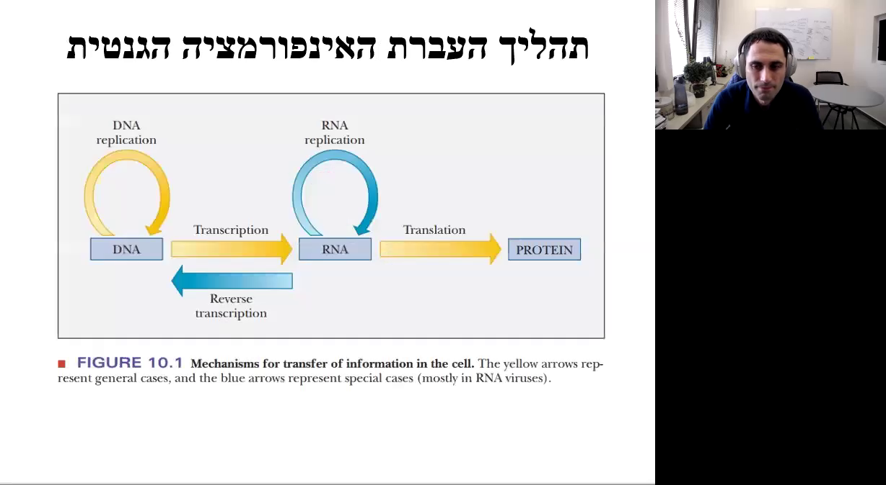

### חלוקת תהליך העברת האינפורמציה לשלושה חלקים (00:00:10 - 00:00:42)

1. **רפליקציה**: הכפלת ה-DNA ליצירת DNA חדש על בסיס האינפורמציה הקיימת.
2. **טרנסקריפציה (תייתוק)**: יצירת RNA על בסיס האינפורמציה של ה-DNA.
3. **טרנסלציה (תרגום)**: יצירת חלבון על בסיס האינפורמציה המקודדת ב-RNA.

### מבנה ה-DNA (00:00:42 - 00:01:04)

ההרצאה ממשיכה לתיאור מבנה ה-DNA, כולל הבסיסים, הנוקלואוטידים והקשרים הכימיים שמחברים ביניהם. הנוקלואוטידים הם אבני הבניין של ה-DNA, והם מורכבים מסוכר, בסיס ופוספט.

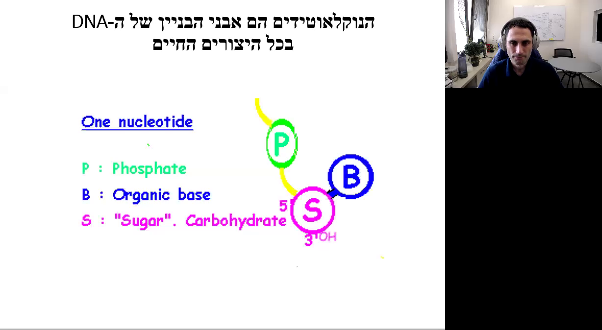

### מבנה הנוקלואוטיד (00:01:04 - 00:01:33)

נוקלואוטידים מורכבים מסוכר (חמישה פחמנים), בסיס ופוספט. הפוספט מחובר בקשר קובלנטי לסוכר, והסוכר מחובר בקשר קובלנטי לבסיס. הסוכר מחזיק משני הצדדים שלו שתי מולקולות צד - פוספט מצד אחד ובסיס מצד שני.

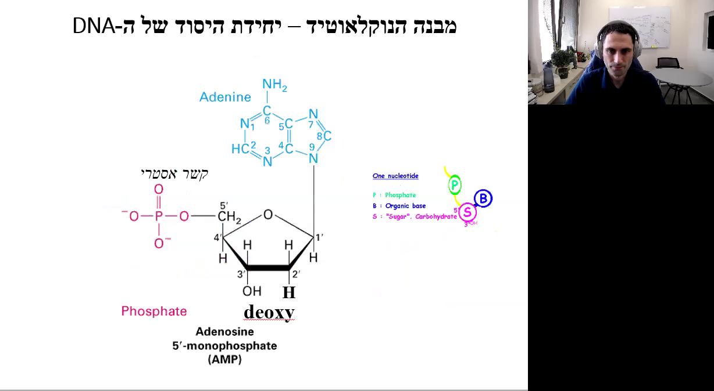

### סוגי סוכרים במולקולות DNA ו-RNA (00:02:24 - 00:03:27)

ישנם שני סוגי סוכרים בטבע: ריבוז (RNA) ודאוקסי ריבוז (DNA). סוכר ה-DNA מיוחד בכך שבעמדה מספר שתיים יש שני מימנים, מה שהופך אותו לדאוקסי ריבוז. לעומת זאת, סוכר ה-RNA מכיל קבוצת הידרוקסיל בעמדה זו.

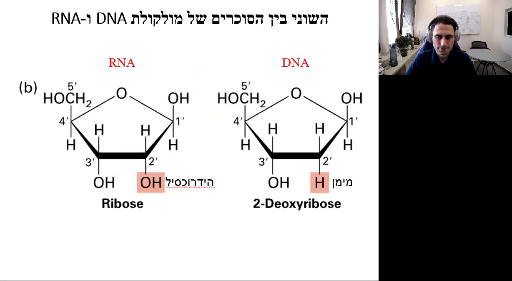

### סוגי הבסיסים והמבנה הכימי שלהם (00:03:27 - 00:05:02)

ישנם ארבעה סוגי בסיסים הקשורים לעמדה מספר אחת של הדאוקסי ריבוז: A (אדנין), G (גואנין), T (טימין) ו-C (ציטוזין). במולקולות של RNA, במקום טימין יש יורציל (U). הבסיסים מחולקים לשתי משפחות: פירמידינים (C, T, U) ופורינים (A, G).

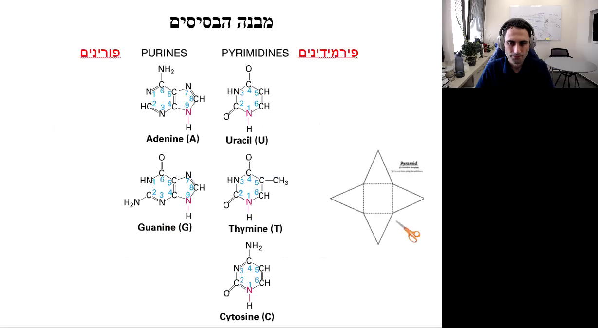

### סיכום

ההרצאה מספקת הבנה מעמיקה על מבנה ה-DNA, הנוקלואוטידים והבסיסים המרכיבים אותו, וכן על תהליך העברת האינפורמציה הגנטית. הידע הזה חיוני להבנת הביולוגיה המולקולרית והגנטיקה.## סיכום הרצאה: מבנה נוקלאוטידים ו-DNA

### מבנה הנוקלאוטידים

ההרצאה מתחילה בהסבר על האטומים והקבוצות הכימיות הקשורות לעמדות השונות בנוקלאוטידים. בעמדה מספר 6 של האדנין יש קבוצה אמינית, בעוד שבגוונין יש חמצן. בנוסף, בעמדה מספר 2 של הגוונין יש קבוצה אמינית, בעוד שבעמדה מספר 2 של האדנין יש קבוצת מימן בלבד. בציטוזין יש קבוצה אמינית בעמדה מספר 4, בעוד שבתימין יש חמצן. כלומר, ההבדלים בין הבסיסים אינם באטומים שנמצאים בתוך התבעת, אלא בקבוצות הצד שקשורות לתבעות. הסוכר והפוספט זהים לחלוטין בין הבסיסים, ומה ששונה בין הנוקלאוטידים הוא הבסיס שמצומד לסוכר.

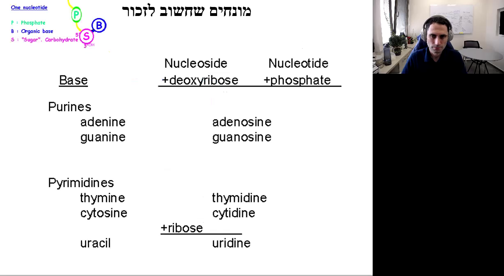

### סוגי נוקלאוטידים

הבסיסים בנוקלאוטידים מתחלקים לפורינים (Adenine, Guanine) ולפירימידינים (Thymine, Cytidine, Uracil). נוקלאוזידים מורכבים מבסיס ודאוקסיריבוז (Deoxyribose) או ריבוז (Ribose), ונוקלאוטידים מורכבים מנוקלאוזיד ופוספט (Phosphate). כאשר הבסיס הוא אדנין, הנוקלאוטיד כולו יקרא אדנוזין, וכך הלאה. יש לזכור את שמות הנוקלאוטידים: אדנוזין, גואנוזין, טימידין, ציטידין ואורידין. כל ה-DNA של כל היצורים החיים בנוי מארבעה נוקלאוטידים בלבד.

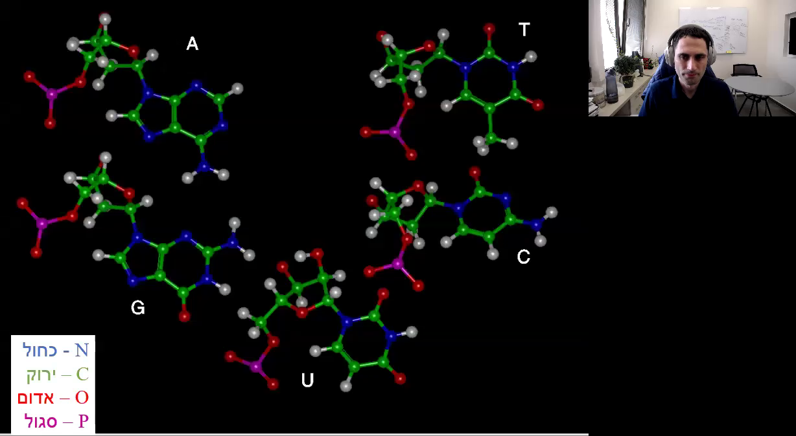

### מבנה סוכר בנוקלאוטידים

הסוכר בנוקלאוטידים הוא דאוקסיריבוז או ריבוז. עמדות 1 ו-4 של הסוכר מחוברות בקשר קובלנטי לחמצן, וזה מסומן באדום. עמדה מספר 5 נמצאת מחוץ לטבעת וקשורה בקשר קובלנטי לחמצן שקישור לפוספט. עמדה מספר 1 קשורה בקשר קובלנטי לקבוצה שנחילה 2 טבעות (פוריסטים) או טבעת אחת (פירימידינים).

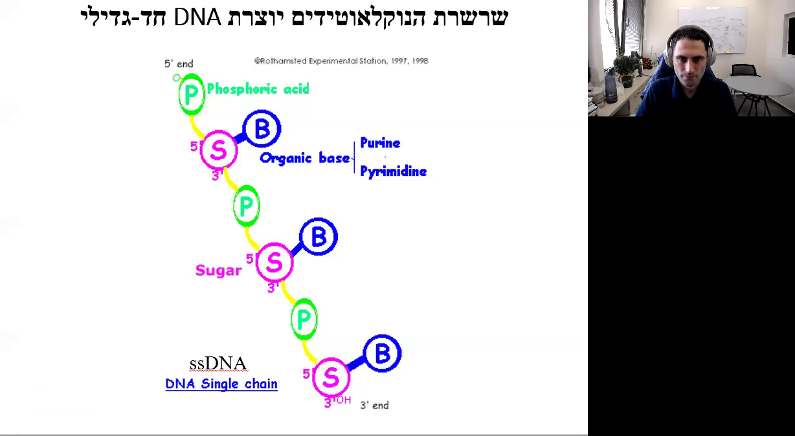

### הקשרים הפוספודיאסטריים

הקשר שמחבר בין נוקלאוטיד אחד לשני הוא קשר 3-5 פוספו-די-אסטרי. עמדה מספר 3 של סוכר אחד מחוברת לעמדה מספר 5 של סוכר שני באמצעות פוספט עם שני קשרים אסתרים. ל-DNA יש כיווניות, וב-DNA של יצורים אאוקריוטים יש שני קצוות: קצה 5 וקצה 3. בנקודה שבה הכרומוזום מתחיל ובזו שהוא מסתיים, בנוקלאוטיד הראשון עמדה מספר 5 מחוברת לפוספט שלא מחובר לסוכר אחר, ולכן הקצה הזה נקרא קצה 5 (Five prime end). בנוקלאוטיד בקצה השני עמדה מספר 3 לא מחוברת לפוספט, ולכן הקצה הזה נקרא קצה 3 (3 prime end).

### כיווניות ה-DNA

ה-DNA הלינארי של יצורים אאוקריוטים יש שני קצוות: קצה 5 וקצה 3. אם מסתכלים לכיוון 5, אומרים שאנחנו מסתכלים אפסטרים, ואם לכיוון 3, אז אנחנו מסתכלים דאונסטרים. בחיידקים יש DNA מעגלי, אין לו קצוות, אבל עדיין לכל נוקלאוטיד יש כיוון 5 פריים ו-3 פריים, לפי עמדות 5 ו-3 של הסוכר.

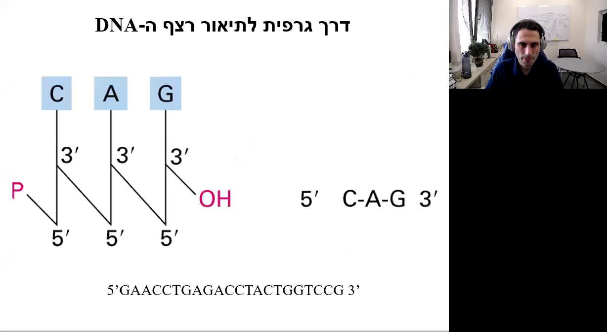

### דרך גרפית לתיאור רצף ה-DNA

ישנן דרכים רבות לתיאור רצף ה-DNA, אך הדרך הבסיסית היא רישום הבסיסים לפי האותיות. הכיוון הוא תמיד משמאל לימין, בדרך כלל יהיה כתוב 5 פריים בהתחלה ו-3 פריים בסיום, אך גם אם לא כתוב לנו שום דבר, זו היא תמיד הכיווניות. הכיווניות היא כמו באנגלית, משמאל לימין.

### סיכום

ההרצאה סיכמה את המבנה הכימי של הנוקלאוטידים וה-DNA, תוך הדגשה על הקבוצות הכימיות השונות והקשרים הפוספודיאסטריים שמחברים בין הנוקלאוטידים. כמו כן, הוסבר על הכיווניות של ה-DNA והדרכים הגרפיות לתיאור רצף ה-DNA.## סיכום ההרצאה

### 00:10:01 - 00:10:20: המעבר מ-DNA חד גדילי לדו גדילי

בקטע זה, המרצה מסביר על הצורך במעבר מ-DNA חד גדילי (ssDNA) לדו גדילי (dsDNA). ה-DNA בטבע קיים תמיד בצורת דו-גדיל, מחיידקים ועד בני אדם. כדי לארוז את שני הגדילים החד גדיליים, נעשה שימוש ביכולת המגנות של הבסיסים, תהליך שנקרא קומפלמנטציה. בקומפלמנטציה, בין G ל-C נוצרים שלושה קשרי מימן ובין A ל-T נוצרים שני קשרי מימן. 

### 00:10:20 - 00:10:55: זיווגי בסיסים ווטסון קריק

זיווגי הבסיסים האלה נקראים זיווגי בסיסים ווטסון קריק. קשרי המימן חלשים יותר מקשרים קובלנטיים ולכן ניתן לנתק אותם, למשל באמצעות טמפרטורה גבוהה. כדי לפרום את זיווג הבסיסים ולפתוח אותו, יש להשקיע יותר אנרגיה בזיווג בין G ל-C, כי יש בו שלושה קשרים. 

### 00:10:55 - 00:11:02: סוגי זיווגי בסיסים

פורין תמיד יוצר קשר עם פירמידים ולהפך. יש רק שני זיווגי בסיסים: A ל-T ו-G ל-C. דוגמה: A לא יכול לעבור זיווג בסיסים עם אף בסיס אחר, רק ל-T, וכך גם G ו-C.

התמונה מציגה תרשים של מבנה DNA-דו-גדילי (dsDNA) עם כיתוב בעברית. התרשים מראה את זוגות הבסיסים (bp) ואת המבנה הכימי של ה-DNA. בצד ימין של התמונה יש טקסטים בעברית המסבירים את המונחים "זוג בסיסים" ו-"DNA-דו-גדילי".

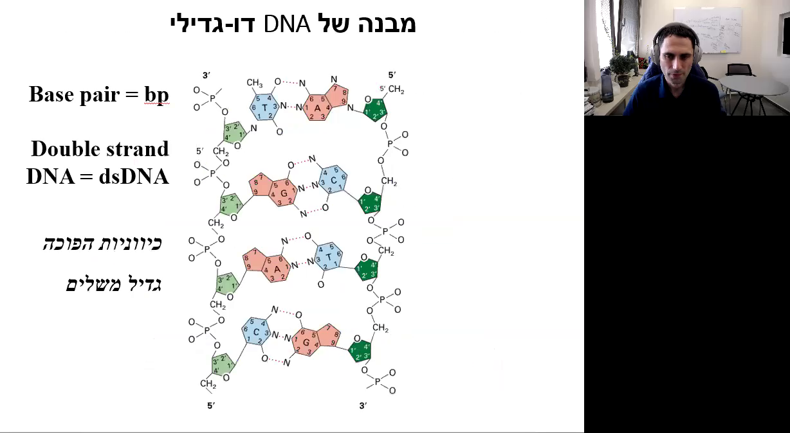

### 00:11:02 - 00:11:56: מבנה DNA דו-גדילי

זיווג הבסיסים מאפשר יצירת DNA דו-גדילי. יש כאן גדיל אחד משמאל ואחד מימין, והכיווניות שלהם היא הפוכה. פוספטים וסוכרים תמיד פונים החוצה, והבסיסים פונים פנימה ויוצרים ביניהם קשרים מימניים. כל זיווג בסיסים כזה הוא כמו שלב בסולם. בכל תא אנושי יש בערך 3 מיליארד זיווגי בסיסים כאלה. הכיווניות בין הגדילים המשלימים חייבת להיות הפוכה כדי שהבסיסים יפנו פנימה וייווצר מבנה סליל.

### 00:11:56 - 00:12:19: המחשה ויזואלית

ה-DNA צריך להידחס לתוך גרעין התא. אם ניקח את ה-DNA שיש לנו בכל תא ונפרוס אותו, נקבל DNA באורך של 2 מטרים. אבל כל ה-DNA הזה צריך להיכנס לגרעין תא שהכותר שלו הוא בערך 10 מיקרומטר. בשביל זה צריך לדחוס את ה-DNA בהרבה רמות. הרמה הראשונה היא ליפוף של הגדילים ליצירת הסליל הכפול.

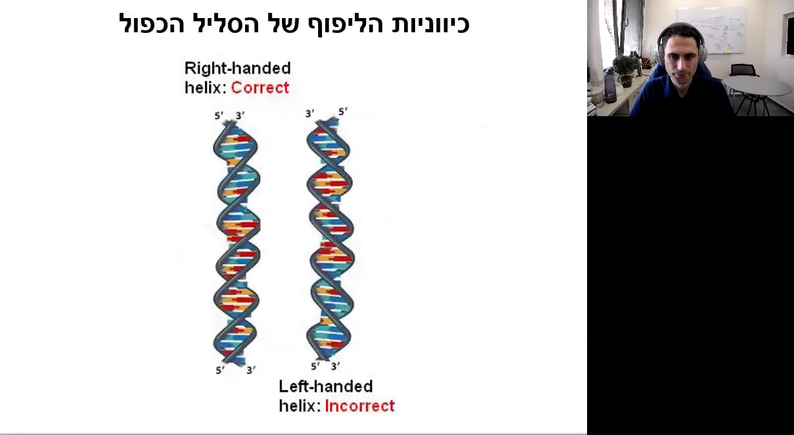

### 00:12:19 - 00:13:01: ליפוף ימני

ה-DNA מלופף תמיד לימין. אם ה-DNA מלופף לשמאל, זה לא תקין. לוקחים את יד ימין ועוברים עם הגודל על הפוספטים והסוכרים כלפי מעלה. אם כשאני מתקדם היד שלי פונה לימין, זהו-DNA שמלופף בליפוף ימני. הבסיסים תמיד ב-90 מעלות לציר הפיתול.

התמונה מציגה תרשים של מולקולת DNA. ניתן לראות את עמוד השדרה הפוספטי-סוכרי (Sugar-phosphate backbone) ואת הבסיסים (Bases) המחוברים ביניהם בקשרי מימן (Hydrogen bonds between bases). בצד ימין של התרשים מופיעים הסברים בעברית.

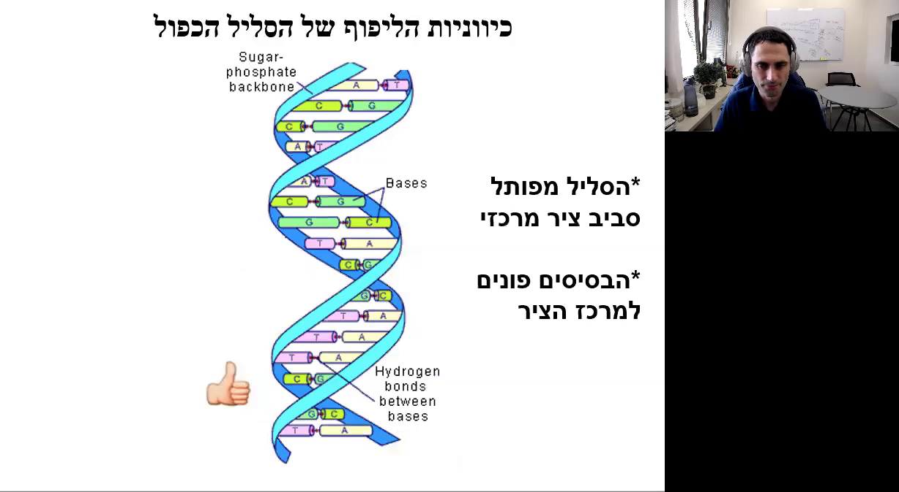

### 00:13:01 - 00:13:48: קשרים תוך מולקולריים

בכל פנייה של סליל כפול, יש 3.6 זוגות נוקלאוטידיים ונוצרים קשרים תוך מולקולריים לחיזוק המבנה הסלילי. הקשרים האלה נקראים קשרי סטקינג והם קשרים מסוג קשרי וונדר ולס. אלו קשרים מחלשים יחסית, אבל מכיוון שיש המון אינטראקציות כאלה, הן עוזרות לעיצוב מבנה הסליל הכפול.

התמונה מציגה תרשים של מבנה הליקס של חלבון, עם כיתוב בעברית שמסביר על הקשרים התוך-מולקולריים שמחזיקים את סליל ההליקס.

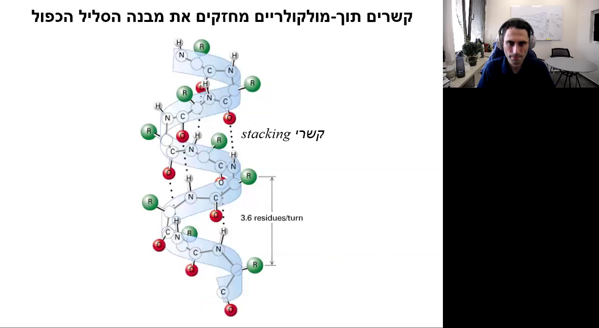

### 00:13:48 - 00:14:30: מגרעות ב-DNA

הסליל הכפול יוצר שתי מגרעות: אחת רחבה (Major groove) ואחת צרה (Minor groove). יש חלבונים שמכירים את מבנה ה-DNA ונקשרים אליו רק ב-Major groove או רק ב-Minor groove.

התמונה מציגה שקף מצגת העוסק במבנה של DNA עם כיתוב המסביר על המגרעות הרחבה והצרה.

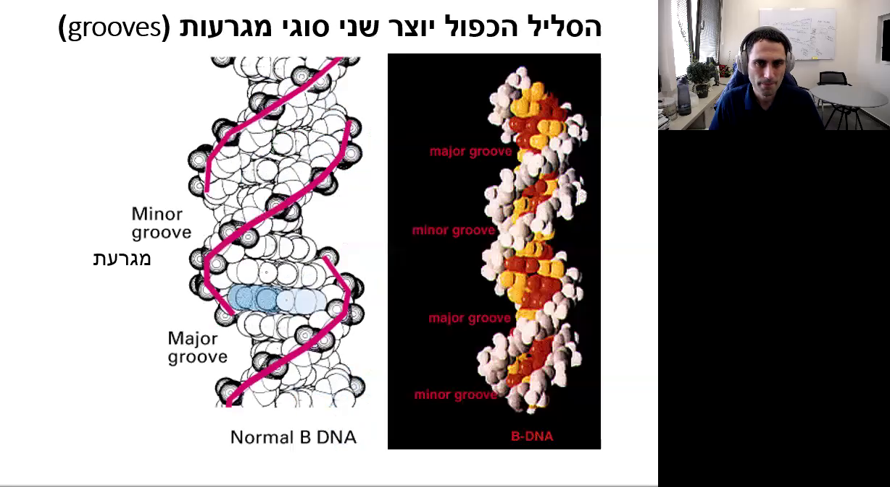

### 00:14:30 - 00:15:01: סיכום מבנה ה-DNA

יש שני גדילים של-DNA שמשלימים זה את זה ונמצאים בכיווניות הפוכה. השילוב של עמוד השדרה הסוכר-פוספט והקשר בין הזוגות מוביל ליצירת הליקס כפול. המרחק בין בסיסים הוא 0.34 ננומטר, סיבוב אחד שלם הוא 3.4 ננומטר והמרחק בין הגדילים הוא 2 ננומטר.

הסלייד מציג מידע על מבנה ה-DNA הכפול הליקס. בצד שמאל של התמונה יש תיאור המסביר כי השילוב של עמוד השדרה הסוכר-פוספט והקשר בין הזוגות מוביל ליצירת הליקס כפול.

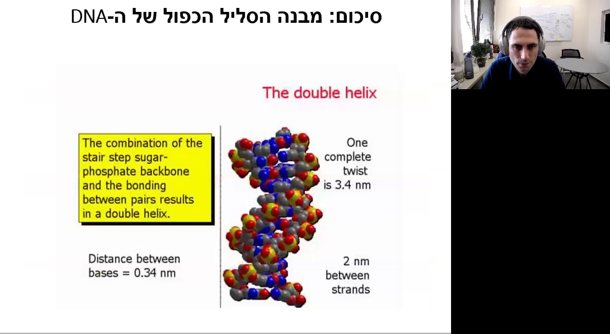

### סיכום הרצאה על מבנה ה-DNA

#### מבנה ה-DNA (00:15:01 - 00:15:18)
ה-DNA מורכב משני גדילים הנמצאים אחד מול השני ויוצרים זיווגי בסיסים. הפוספטים והסוכרים של ה-DNA פונים החוצה, ואטומי הפוספט בעלי מטען שלילי, מה שהופך את מולקולת ה-DNA כולה לבעלת מטען שלילי. ה-DNA נתלפף לימין, ורוחבו הוא 22 אנגסטרום (Angstrom, יחידת מידה השווה ל-10 בחזקה מינוס 10 מטר). המרחק בין בסיסים סמוכים הוא 3.4 אנגסטרום, והמרחק מנקודה אחת בפיתול עד לאותה נקודה בפיתול הבא הוא 34 אנגסטרום, כלומר מרחק של 10 זיווגי בסיסים.

#### סופר קוילינג (00:15:18 - 00:16:01)

אם נדחוס את ה-DNA או נפתח אותו ויהיו בו פחות מ-10 זיווגי בסיסים מנקודה אחת בפיתול ועד הנקודה הבאה, יתקבל מצב לא תקין שנקרא סופר קוילינג. ישנם חלבונים בתא שתפקידם לפתוח את הסופר קוילינג ולהחזיר את ה-DNA למצבו התקין.

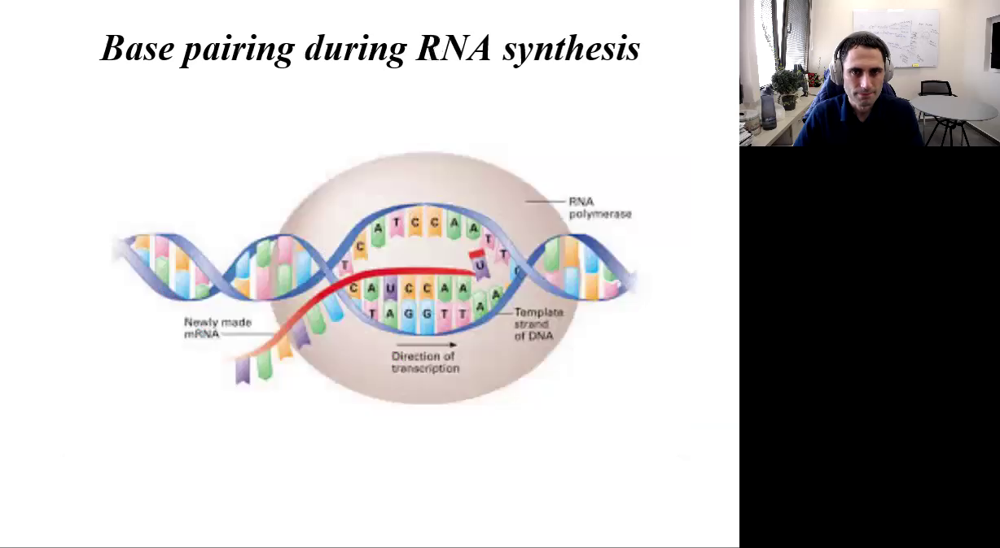

#### פתיחת הסליל הכפול של ה-DNA (00:16:01 - 00:16:56)
הסליל הכפול של ה-DNA נפתח בשני מצבים עיקריים: במהלך הרפליקציה, אז נפתח ה-DNA הדוגדילי ל-DNA חד גדילי כדי שניתן יהיה לסנתז DNA חדש על בסיס כל אחד מהגדילים; ובמהלך הטרנסקריפציה, שבמהלכה נוצר ה-RNA ממולקולת ה-DNA. במצבים אלה, ה-DNA הדוגדילי נפתח ל-DNA חד גדילי באופן זמני לשם תיאתוק הגנים. מרבית המוטציות ב-DNA מתרחשות בזמן אחד מהמצבים האלה, שבהם ה-DNA נמצא באופן זמני כ-DNA חד גדילי ולכן הוא פגיע ונגיש יותר לחומרים שיכולים לגרום לו למוטציות.

#### דנטורציה ורנטורציה של DNA (00:16:56 - 00:17:52)

במעבדה וברפואה, פעמים רבות נרצה להפריד בין גדילי ה-DNA, לדוגמה כדי לרצף את ה-DNA ולגלות את רצף הנוקלואוטידים לצורך זיהוי של מוטציה. בדרך כלל עושים זאת באמצעות חימום של מולקולת ה-DNA או באמצעות הוספת מולקולות עם מטען חשמלי שלילי או חיובי שמפרקות את כשרי המימן. פתיחת ה-DNA הדוגדילי נקראת דנטורציה (Denaturation), ולאחר התהליך הזה נרצה להחזיר את ה-DNA החד גדילי למצב הדוגדילי, ולתהליך הזה קוראים רנטורציה (Renaturation).

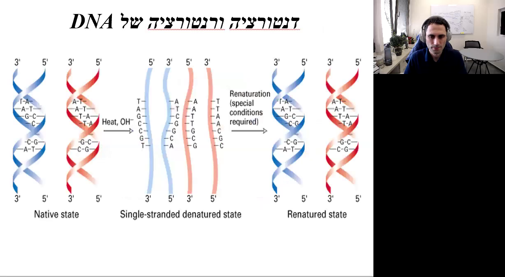

#### סיכום מבנה ה-DNA (00:17:52 - 00:17:59)
הסרטון מסכם את מבנה ה-DNA, כולל תהליכי הדנטורציה והרנטורציה, ומציג את המידע החשוב על זיווגי בסיסים, סופר קוילינג, ופתיחת הסליל הכפול במצבים שונים.

---

מידע זה נועד להחליף את הצורך בצפייה בהרצאה, ומכסה את כל הנקודות המרכזיות שהוזכרו.
